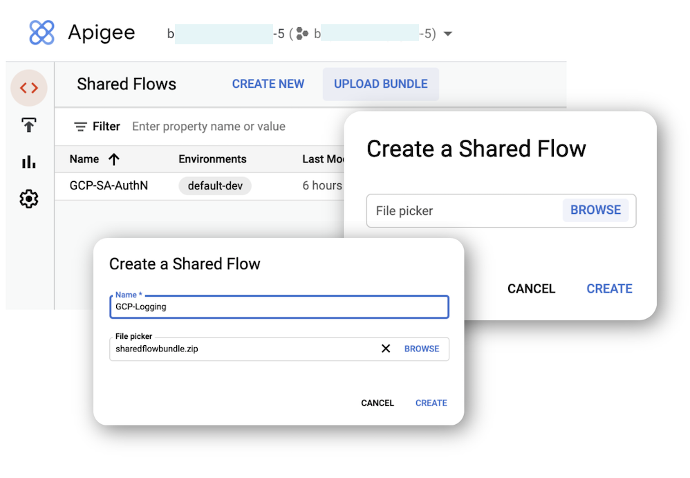
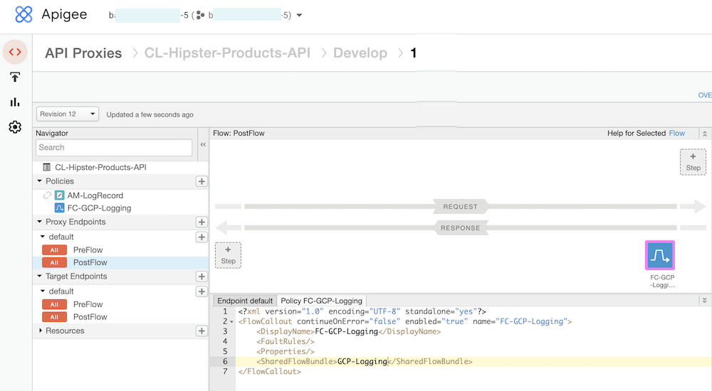

[](https://pypi.python.org/pypi/ansicolortags/) 

# Apigee X - Googlee Cloud Logging Shared Flow

**This is not an official Google product.**<BR>This implementation is not an official Google product, nor is it part of an official Google product. Support is available on a best-effort basis via GitHub.

***

## Intro

This repository contains a sharedflow for Apigee X to send proxy logs to Google Cloud Logging.<br>
It is based on [DinoChiesa / Apigee-GCP-Logging-Example](https://github.com/DinoChiesa/Apigee-GCP-Logging-Example), but updated to  be deployed on Apigeee X as a Sharedflow

## Requirement

## Installation

### Setting up GCP

To authorize Apigee X to send logs records to Google Cloud Logging, you must first: 
- Create a service account in Google Cloud and assign it the necessary roles (at least, Logs Writer)
- Create and download a json key for the service account

To create it in your Apigee organization's GCP project, use following gcloud commands (or GCP Web UI):

```sh
SA_NAME=<your-new-service-account-name>

gcloud iam service-accounts create $SA_NAME --display-name="Apigee Logging"

PROJECT_ID=$(gcloud config get-value project)
APIGEE_LOGGING_SA=$SA_NAME@$PROJECT_ID.iam.gserviceaccount.com

gcloud projects add-iam-policy-binding "$PROJECT_ID" \
  --member="serviceAccount:$APIGEE_LOGGING_SA" \
  --role="roles/logging.logWriter"

gcloud iam service-accounts keys create $SA_NAME-key.json --iam-account=$APIGEE_LOGGING_SA --key-file-type=json 

```

You will use values from json key file during Apigee X KVM configuration.

### Setting up the KVMs

The sharedflow uses 2 crypted KVMs to store parameters and credentials to access to GCP Logging service:
- GCP-Keys: 
    - key "gcplogging.privKeyPem": the PEM-encoded private key (**private_key**) from Service Account json key file 
- GCP-Logging-settings: 
    - key "gcplogging.jwt_issuer": **client_email** from Service Account json key file
    - key "gcplogging.logid": logname used to store Apigee log record in Cloud Logging
    - key "gcplogging.projectid": Google Cloud Logging Project Id, **project_id** from Service Account json key file

The KVMs in Apigee X (or hybrid) still need to be created via the management API or the Apigee UI but their content can only be created, read or deleted from within the runtime from a KeyValueMapOperations policy (see Apigee Community Article [Providing KVM Content APIs for Apigee X and hybrid](https://community.apigee.com/articles/89782/providing-kvm-content-apis-for-apigee-x-and-hybrid.html))


A full example of an implementation of the GET, POST and DELETE methods for KVMs with a dynamic name can be found in the Apigee DevRel Github repository: [kvm-admin-api](https://github.com/apigee/devrel/tree/main/references/kvm-admin-api). 

We will use it in next steps to initialize GCP-Keys and GCP-Logging-settings KVMs.
To deploy kvm-admin-api, follow instructions in [Apigee DevRel Github repository](https://github.com/apigee/devrel/tree/main/references/kvm-admin-api).


Then, create KVMs using Apigee API:

```sh
export TOKEN=$(gcloud auth print-access-token)
export APIGEE_ORG=<my-org-name>
export APIGEE_ENV=<my-env>
export KVM_NAME1=GCP-Keys
export KVM_NAME2=GCP-Logging-settings

curl -X POST \
    "https://apigee.googleapis.com/v1/organizations/${APIGEE_ORG}/environments/$APIGEE_ENV/keyvaluemaps" \
    -H "Authorization: Bearer $TOKEN" \
    -H "Content-Type: application/json" \
    --data "{\"name\":\"$KVM_NAME1\",\"encrypted\": true}"

curl -X POST \
    "https://apigee.googleapis.com/v1/organizations/${APIGEE_ORG}/environments/c/keyvaluemaps" \
    -H "Authorization: Bearer $TOKEN" \
    -H "Content-Type: application/json" \
    --data "{\"name\":\"$KVM_NAME2\",\"encrypted\": true}"
```

After that, create KVM entries using kvm-admin-api:

```sh
export TOKEN=$(gcloud auth print-access-token)
export APIGEE_HOSTNAME=<my-apigee-hostname>
export APIGEE_ORG=<my-org-name>
export APIGEE_ENV=<my-env>
export KVM_NAME1=GCP-Keys
export KVM_NAME2=GCP-Logging-settings

curl -i -X POST \
   "https://$APIGEE_HOSTNAME/kvm-admin/v1/organizations/${APIGEE_ORG}/environments/$APIGEE_ENV/keyvaluemaps/$KVM_NAME1/entries"
   -H "Content-Type:application/json" \
   -H "Authorization:Bearer $TOKEN" \
   -d '{ "key": "gcplogging.privKeyPem", "value": "<copy here private_key value from SA json key file>" } ' \

curl -i -X POST \
  "https://$APIGEE_HOSTNAME/kvm-admin/v1/organizations/${APIGEE_ORG}/environments/$APIGEE_ENV/keyvaluemaps/$KVM_NAME2/entries"
   -H "Content-Type:application/json" \
   -H "Authorization:Bearer $TOKEN" \
   -d '{ "key": "gcplogging.jwt_issuer", "value": "<copy here client_email value from SA json key file>"}' 

curl -i -X POST \
   "https://$APIGEE_HOSTNAME/kvm-admin/v1/organizations/${APIGEE_ORG}/environments/$APIGEE_ENV/keyvaluemaps/$KVM_NAME2/entries"
   -H "Content-Type:application/json" \
   -H "Authorization:Bearer $TOKEN" \
   -d '{ "key": "gcplogging.logid", "value": "apigee-logs"}' 

curl -i -X POST \
   "https://$APIGEE_HOSTNAME/kvm-admin/v1/organizations/${APIGEE_ORG}/environments/$APIGEE_ENV/keyvaluemaps/$KVM_NAME2/entries"
   -H "Content-Type:application/json" \
   -H "Authorization:Bearer $TOKEN" \
   -d '{ "key": "gcplogging.projectid", "value": "<copy here project_id value from SA json key file>" }' 

```

Note: you could use the same curl commands to update the KVM entries.

### Installing Sharedflow

Upload Shared Flow and deploy it:
- Zip **sharedflowbundle** folder from this repository
- From Apigee X, **Develop** menu, **Shared Flows**, click **Upload Bundle**
- Browse your folders and select zip file: click **Open**
- Enter a name for the new Shared Flow 



- Deploy it to your target environment


## Using Sharedflow in your proxies

To use this shared flow in you proxy, insert a FlowCallout policy in Proxy Endpoint PostFlow



> As implemented in [DinoChiesa / Apigee-GCP-Logging-Example](https://github.com/DinoChiesa/Apigee-GCP-Logging-Example), you can send logs to Google Cloud Logging asynchronously (httpClient from within a JavaScript callout) with a minimum of delay introduced into the proxy flow, or wait for a  Google Cloud Logging response (ServiceCallout policy). 
Call your proxy with header **useSC** = true, if you want to use ServiceCallout.

> If you want to customize Log Format, edit the script linked to Javascript policy **JS-SetLoggingRecord** in the Shared Flow. Current log format is:

```javascript
var organization = context.getVariable("organization.name");
var environment = context.getVariable("environment.name");
var region = context.getVariable("system.region.name") || "none";
var apiProxy = context.getVariable("apiproxy.name");
var apiProxyRevision = context.getVariable("apiproxy.revision");
var requestUrl = context.getVariable("request.url");
var verb =  context.getVariable("request.verb");
var correlationId = context.getVariable("messageid");
var client_ip = context.getVariable("client.ip");
var target_ip = context.getVariable("target.ip") || "none";
var target_host = context.getVariable("target.host") || "none";
var proxyRequestReceived = context.getVariable("client.received.end.timestamp");
var proxyResponseSent = context.getVariable("client.sent.end.timestamp");
var targetResponseReceived = context.getVariable("target.received.end.timestamp") || "none";
var targetRequestSent = context.getVariable("target.sent.end.timestamp") || "none";
var targetResponseCode = context.getVariable("message.status.code") || "none";
var proxyResponseCode = context.getVariable("response.status.code") || "none";
var fault_name = context.getVariable("fault.name") || "none";


var LogRecord = {
  "organization": organization,
  "environment": environment,
  "region": region,
  "apiProxy": apiProxy,
  "apiProxyRevision": apiProxyRevision,
  "requestUrl": requestUrl,
  "verb": verb,
  "correlationId": correlationId,
  "client_ip": client_ip,
  "target_ip": target_ip, 
  "target_host": target_host, 
  "proxyRequestReceived": proxyRequestReceived,
  "proxyResponseSent": proxyResponseSent,
  "targetResponseReceived": targetResponseReceived,
  "targetRequestSent": targetRequestSent,
  "targetResponseCode": targetResponseCode,
  "proxyResponseCode": proxyResponseCode,
  "faultName": fault_name
 }

...
```
